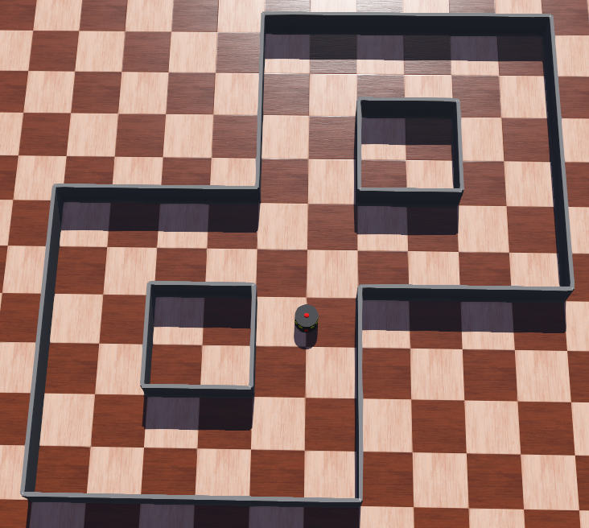
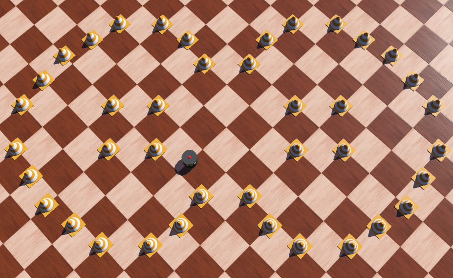

# Webots Driverless Simulation Competition

## Background
The system design and code for a driverless vehicle needs to be validated before being tested on a driverless car in a physical environment. Unfortunately, before the code can be tested physically, we must undergo the expensive process of organising a suitable location/event, ensure the electrical and mechanical systems of the vehicle are operational, and accept the risk of errors causing damage to the car.  

On the other hand, simulation software provides a virtual environment in which to cheaply, easily and safely experiment with various methods of autonomous navigation. 

## Task
You will be given a standard vehicle in the Webots robotics simulator. This vehicle contains a basic kinematic tyre/axle model with a set of motors, as well as the following sensors:

- Distance Sensors
- Lidar
- Camera
- Gyroscope
- Accelerometer

You will also be given a series of virtual environments on which to test your autonomous vehicle:

- A simple track with walls as boundaries
- A track composed of cones, replicating a competition track

  
  

 

You are to program this autonomous vehicle to navigate for at least one full lap around a track. You can use any of the supported languages to write the robot controller. You may use any combination of sensors to accomplish this, as well as computer vision implementations. Please ensure that your code is at least somewhat readable, add comments if it helps.

Once functional, the goal is to optimise the navigation algorithm to achieve the fastest lap times possible, avoiding collisions, for multiple laps around each track. Then, once the project is complete, your car will be time trialled against other team’s cars for some competitive fun!

## Resources

Webots Tutorial:

https://cyberbotics.com/doc/guide/tutorials

Webots Documentation:

https://cyberbotics.com/doc/reference/nodes-and-api-functions

Other References:

- [Intro Webots](https://cyberbotics.com/doc/guide/tutorial-1-your-first-simulation-in-webots)
- [More about Controllers](https://cyberbotics.com/doc/guide/tutorial-4-more-about-controllers )
- [Accelerometer](https://www.cyberbotics.com/doc/reference/accelerometer )
- [Camera](https://www.cyberbotics.com/doc/reference/camera )
- [Distance Sensor](https://www.cyberbotics.com/doc/reference/distancesensor )
- [Gyro](https://www.cyberbotics.com/doc/reference/gyro )
- [Lidar](https://www.cyberbotics.com/doc/reference/lidar )
- [Motor](https://www.cyberbotics.com/doc/reference/motor )
- [Robot](https://www.cyberbotics.com/doc/reference/robot )

## Submission
Fork the given git repository, and then add all your code to this repository. Send us a link to this once the project is complete. 